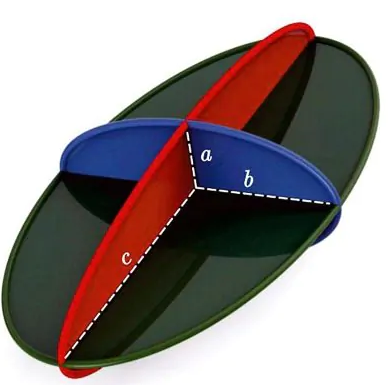

# Cálculo da bolha dentro da mangueira

Para fazer o cálculo da bolha utilizamos a fórmula de volume de elipsoide, definida por:

$V = \frac{4}{3}\cdot \pi \cdot A \cdot B \cdot C$

Onde:

* $A =$ Semieixo que representa metade do comprimento maior do elipsóide, equivalente ao raio maior da elipse em sua seção transversal. No caso de um elipsóide, é a maior distância de um ponto à superfície oposta, passando pelo centro.

* $B =$ Semieixo que representa metade do comprimento médio do elipsóide, equivalente ao raio menor da elipse em sua seção transversal perpendicular ao semieixo principal.

* $C =$ Metade do comprimento menor do elipsóide, perpendicular aos semieixos principal e intermediário.

   

$A$ e $B$ serão definidos como o raio da mangueira onde a bolha estará passando. 

Já o valor de $C$ será definido de acordo com a vazão atual da mangueira, a equação do fluxo volumétrico é dada por:

$Q = A \cdot V$

Onde:

* $Q$ é o fluxo volumétrico (vazão) em $\frac{m^3}{s} $ (metros cúbicos por segundo),
* $A$ é a área da seção transversal da mangueira em $m^2$ (metros quadrados),
* $V$  é a velocidade do fluido dentro da mangueira em $\frac{m}{s}$ (metros por segundo).

O cálculo é apenas demonstrativo, visto que o sensor de vazão dará esse resultado em tempo real.

Agora para determinar a distância percorrida por um ponto ao longo do tempo, você precisará integrar a velocidade em relação ao tempo. Isso pode ser feito considerando a vazão constante e usando a fórmula:

$Distância = Vazão \cdot Tempo$

O valor da vazão na forma será definido no momento em que a bolha for identificada, onde o sensor de vazão irá definir qual valor será utilizado no momento.

Como resultado final, temos que o valor $C$ será definido como:

$C = \frac{Distância}{2} $

